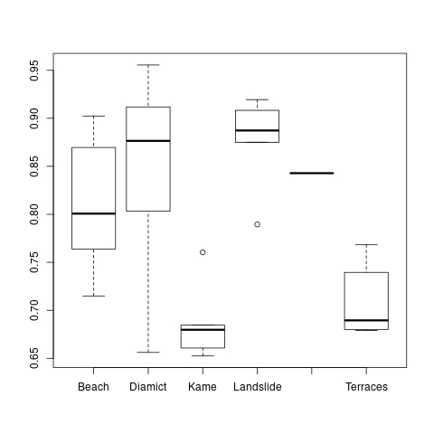
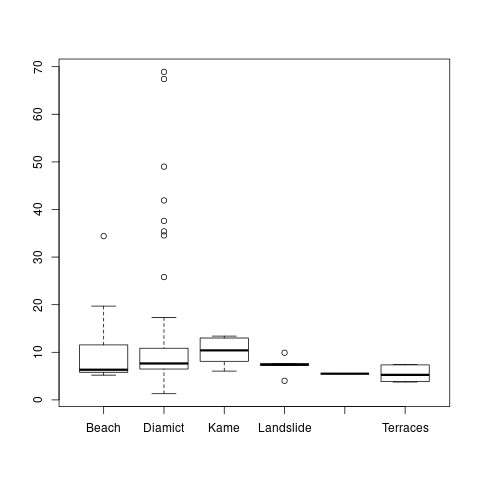

# SMDE FIRST ASSIGNEMENT (20% OF THE FINAL MARK, INDIVIDUAL)

## First question: generate a random sample.

On this exercise we are going to start working with probability distributions. The first
work to do is to generate more than 200 observations of your selected
probability distribution. We are going to generate this using a Spreadsheet.

Now you must import this distribution to R and test the fitting of the values with a
new sample now generated by R. Use for the fitting a Chi-square test.

Is the sample generated by the Spreadsheet correct?

Test other 5 different distributions and analyze the results (i.e. modify the
distribution or the parameters used).

Justify your answers.

---

First, I am going to select the uniform distribution. Then, using for instance 
the bash shell, I can generate N = 1000 observations.

	$ for i in {1..1000}; do echo $RANDOM; done > data/bash-rand.txt
	$ head data/bash-rand.txt | column -c 72
	9717	14506	32194	26243	8759
	17150	470	7278	30890	23301

I have selected this distribution because I am interested in testing the random 
number generation of the bash shell particularly.

The range of the values generated is [0, 32767] as they are signed integers of 
16 bits.

By using the following snipped, I can import the values into R, and generate a 
random sample using `sample()` and `seq()`:

	> unif_bash = read.csv("data/bash-rand.txt", header=FALSE)[[1]]
	> head(unif_bash)
	[1]  9717 17150 14506   470 32194  7278

Now the statement asks for *test the fitting of the values with a new sample now 
generated by R* by using a *Chi-square test*. The reference book "Probability 
and statistics for Computer Scientists, 2º Ed. Michael Baron", included in the 
main bibliography of the course, indicates how to test the fitting of a sample 
in a model.

The main idea is to split the values into N bins, and count the number of 
elements in each bin k, say Obs(k). The number of bins should be between 5 and 8 
. Then we compare the number of Obs(k) with the expected number, using the 
distribution of the model.

The number:

	chi^2 = sum of k=1 to N ( Obs(k) - Exp(k) )^2 / Exp(k)

Follows a chi-squared distribution and can be used to test the goodness of fit.

To do so, we need to compute the expected number of values in each bin. If we 
use 8 bins equiseparated by 4096, then the expected number is n/8.

	> breaks = seq(0, 32768, by=4096)
	> x = cut(unif_bash, breaks)
	> chisq.test(table(x), p=rep(1/8, 8))

		Chi-squared test for given probabilities

	data:  table(x)
	X-squared = 5.28, df = 7, p-value = 0.6258

From the test, we cannot reject the hypothesis that the sample follows the 
uniform distribution, there is no significant evidence, as p-value > 0.05 . So 
the default procedure is to accept the distribution as correct.

Note that there is no *new sample now generated by R*. What we computed from R 
is the expected count in each bin, based on the distribution.

The case with the uniform distribution is easy, because it is easy to compute 
the expected number of counts in each bin from the distribution. With more 
complex distributions we need to compute the area of the probability density 
function in the bin interval.

To do such task, I used a python program, which generates random samples from 
different distributions, then computes the correct bins and counts, and then 
performs the chi-squared test against the original distribution. The results 
show 10 simulations for distribution, using 1000 elements per sample, 8 bins:

	$ python src/chi.py
	------ Test of norm distribution ------
	p-value = 0.2509
	p-value = 0.3768
	p-value = 0.7536
	p-value = 0.9213
	p-value = 0.2896
	p-value = 0.3753
	p-value = 0.8087
	p-value = 0.8365
	p-value = 0.4165
	p-value = 0.0538
	------ Test of expon distribution ------
	p-value = 0.5567
	p-value = 0.5910
	p-value = 0.8193
	p-value = 0.7135
	p-value = 0.3647
	p-value = 0.1687
	p-value = 0.5011
	p-value = 0.5084
	p-value = 0.9123
	p-value = 0.4975
	------ Test of uniform distribution ------
	p-value = 0.2845
	p-value = 0.9741
	p-value = 0.9944
	p-value = 0.0635
	p-value = 0.3242
	p-value = 0.9042
	p-value = 0.3411
	p-value = 0.5379
	p-value = 0.0045 ***
	p-value = 0.9200
	------ Test of cauchy distribution ------
	p-value = 0.4903
	p-value = 0.2498
	p-value = 0.6142
	p-value = 0.9096
	p-value = 0.2310
	p-value = 0.1654
	p-value = 0.7019
	p-value = 0.6824
	p-value = 0.8158
	p-value = 0.6239
	------ Test of rayleigh distribution ------
	p-value = 0.2278
	p-value = 0.5175
	p-value = 0.0731
	p-value = 0.5342
	p-value = 0.1598
	p-value = 0.5586
	p-value = 0.5175
	p-value = 0.4149
	p-value = 0.0809
	p-value = 0.5139

We see that only one simulation produced a result with a p-value under 0.05, so 
we should reject that sample. It is expected about 5% of the runs to be 
incorrectly rejected.

## Second question: compare three samples.

Generate three populations that follow your specific distribution, but now
change one of the parameters (change it following your criteria). As an example,
the first is a population that follows an exponential distribution with a
parameter k=10, the second with k=20, and the third with k=30.

We want to analyze using an ANOVA if these three populations are different (or
not) depending on the parameter selected.

Remember to test the ANOVA assumptions. What do you expect on the assumptions?

Analyze and explain the results obtained. Justify your answers.

---

Using the normal distribution, with mean 10, 20 and 30, we generate 3 samples
with 1000 elements. Then 3 tests are performed:

The ANOVA test is based in 3 assumptions. All the populations should be normal 
so a Shaphiro test is performed. All the observations must be independent, so a 
Durbit Watson test is performed. And the samples must have the same variance, so 
a Breusch Pagan test is performed.

If all of the three tests pass, then the ANOVA test can proceed. Every test is 
checked by it's p-value. If is less than alpha (0.05) the significance level, 
the test is assumed as failed. The example code produces:

	[1] "Shapiro-Wilk normality test passed."
	[1] "Durbin-Watson test passed."
	[1] "Studentized Breusch-Pagan test passed."

After the 3 tests are passed, we can use ANOVA, to test if the populations are
different.

	$ Rscript src/2.R
	Loading required package: zoo

	Attaching package: ‘zoo’

	The following objects are masked from ‘package:base’:

	    as.Date, as.Date.numeric

		Shapiro-Wilk normality test

	data:  residuals(anova)
	W = 0.99938, p-value = 0.4379

	[1] "Shapiro-Wilk normality test passed."

		Durbin-Watson test

	data:  anova
	DW = 1.9879, p-value = 0.727
	alternative hypothesis: true autocorrelation is not 0

	[1] "Durbin-Watson test passed."

		studentized Breusch-Pagan test

	data:  anova
	BP = 0.013691, df = 1, p-value = 0.9069

	[1] "Studentized Breusch-Pagan test passed."
	[1] "The ANOVA test shows that the hypothesis of equal mean should be
	rejected."
		      Df Sum Sq Mean Sq F value Pr(>F)
	k              1 200540  200540  187132 <2e-16 ***
	Residuals   2998   3213       1
	---
	Signif. codes:  0 ‘***’ 0.001 ‘**’ 0.01 ‘*’ 0.05 ‘.’ 0.1 ‘ ’ 1

In the output, we can see the 3 tests with p-values greater than 0.05, so we
consider the 3 asumptions met. The ANOVA test shows a very significant evidence 
that the null hypothesis (the data has equal mean in all samples) should be 
rejected. We finally accept the alternative hypothesis, and confirm that the 
data don't have equal mean between samples, which is consistent with our samples 
generated with different means.

### Once we are familiar with ANOVA, answer this question:

On the dataset contained on FactoMiner package named geomorphology, we want
to analyze if Drift is a factor that defines different block sizes (Block.size.median
variable) or wind effects (variable Wind.effect).

Useful code:

	data(geomorphology, package="FactoMineR")

---

To load the dataset, I extracted just the file from FactoMineR, and its placed 
under the `data/` directory. To load in R:

	> load("data/geomorphology.rda")

To see how the two variables are affected by `Drift`, we can use a boxplot.

	> boxplot(Wind.effect~Drift, data=geomorphology)

	> boxplot(Block.size.median~Drift, data=geomorphology)

As can be seen visually, the Wind.effect presents big differences in the data, 
but in the case of Block.size.median, those differences are small.

We can use ANOVA to test if the different samples have the same mean. So by 
splitting the dataset using the variable Drift, we get:

	> summary(aov(Wind.effect ~ Drift, data=geomorphology))
		    Df Sum Sq Mean Sq F value   Pr(>F)    
	Drift        5 0.2395 0.04790   10.07 2.86e-07 ***
	Residuals   69 0.3280 0.00475                     
	---
	Signif. codes:  0 ‘***’ 0.001 ‘**’ 0.01 ‘*’ 0.05 ‘.’ 0.1 ‘ ’ 1

	> summary(aov(Block.size.median ~ Drift, data=geomorphology))
		    Df Sum Sq Mean Sq F value Pr(>F)
	Drift        5    644   128.9   0.726  0.606
	Residuals   69  12246   177.5

It can be seen that the ANOVA test rejects the hypothesis of equal mean on the 
first case, as expected. But is not capable of reject the null hypothesis on the 
second case. So we assume that the Drift variable is related to the 
`Wind.effect` but not to the `Block.size.median`.

## Third question: define a linear model for an athlete in the 1500 m.

To start: load the package RCmdrPlugin.FactoMinerR.

Load the data "decathlon" located in the package.

The data represents a data frame with observations for different athletes.

What is the linear expression that better predicts the behavior of an
athlete for 1500m?

Explore different expressions describing the power and the features of each one
of them.

Justify your answers.

Remember to test the assumptions of the linear model.

---

To import the dataset *decathlon*, I couldn't find the package 
*RCmdrPlugin.FactoMinerR*:

	> library('RCmdrPlugin.FactoMinerR')
	Error in library("RCmdrPlugin.FactoMinerR") : there is no package called
	‘RCmdrPlugin.FactoMinerR’

	> install.packages('RCmdrPlugin.FactoMinerR')
	Installing package into ‘/home/rodrigo/R/x86_64-pc-linux-gnu-library/3.3’
	(as ‘lib’ is unspecified)
	--- Please select a CRAN mirror for use in this session ---
	Warning message:
	package ‘RCmdrPlugin.FactoMinerR’ is not available (for R version 3.3.3)

But the package *FactoMineR* provided the dataset, however the process of 
downloading and compiling this package and all the depencies requires a 
sustantial amount of time and resources.

So instead of using this procedure, I decided to download the single dataset 
from the *FactoMineR* [website](
http://factominer.free.fr/classical-methods/datasets/decathlon.txt) and use only 
that small file instead.

	$ wget -qO data/decathlon.csv \
	http://factominer.free.fr/classical-methods/datasets/decathlon.txt
	$ md5sum data/decathlon.csv
	7c14ba6f61e59c16cacb0d55624d39a4  data/decathlon.csv
	$ head -1 data/decathlon.csv | tr '\t' '\n'
	"100m"
	"Long.jump"
	"Shot.put"
	"High.jump"
	"400m"
	"110m.hurdle"
	"Discus"
	"Pole.vault"
	"Javeline"
	"1500m"
	"Rank"
	"Points"
	"Competition"

Now we can read the file as a csv separated by tabs in R:

	> decathlon = read.csv('data/decathlon.csv', sep='\t')
	> summary(decathlon)
	     X100m         Long.jump       Shot.put       High.jump         X400m
	 Min.   :10.44   Min.   :6.61   Min.   :12.68   Min.   :1.850   Min.   :46.81
	 1st Qu.:10.85   1st Qu.:7.03   1st Qu.:13.88   1st Qu.:1.920   1st Qu.:48.93
	 Median :10.98   Median :7.30   Median :14.57   Median :1.950   Median :49.40
	 Mean   :11.00   Mean   :7.26   Mean   :14.48   Mean   :1.977   Mean   :49.62
	 3rd Qu.:11.14   3rd Qu.:7.48   3rd Qu.:14.97   3rd Qu.:2.040   3rd Qu.:50.30
	 Max.   :11.64   Max.   :7.96   Max.   :16.36   Max.   :2.150   Max.   :53.20
	  X110m.hurdle       Discus        Pole.vault       Javeline
	 Min.   :13.97   Min.   :37.92   Min.   :4.200   Min.   :50.31
	 1st Qu.:14.21   1st Qu.:41.90   1st Qu.:4.500   1st Qu.:55.27
	 Median :14.48   Median :44.41   Median :4.800   Median :58.36
	 Mean   :14.61   Mean   :44.33   Mean   :4.762   Mean   :58.32
	 3rd Qu.:14.98   3rd Qu.:46.07   3rd Qu.:4.920   3rd Qu.:60.89
	 Max.   :15.67   Max.   :51.65   Max.   :5.400   Max.   :70.52
	     X1500m           Rank           Points       Competition
	 Min.   :262.1   Min.   : 1.00   Min.   :7313   Decastar:13
	 1st Qu.:271.0   1st Qu.: 6.00   1st Qu.:7802   OlympicG:28
	 Median :278.1   Median :11.00   Median :8021
	 Mean   :279.0   Mean   :12.12   Mean   :8005
	 3rd Qu.:285.1   3rd Qu.:18.00   3rd Qu.:8122
	 Max.   :317.0   Max.   :28.00   Max.   :8893

We see that the columns that started with a number like "100m" had been prefixed 
with a "X" like "X100m".

To predict the behavior of an athlete for the 1500 m run, we can build a linear 
model using all the variables, and see which ones provide more relationship to 
the predicted variable (X1500m).

	> rm1 = lm(X1500m ~ ., data=decathlon)

	> summary(rm1)

	Call:
	lm(formula = X1500m ~ ., data = decathlon)

	Residuals:
	     Min       1Q   Median       3Q      Max
	-1.11082 -0.40320 -0.02978  0.37054  0.99005

	Coefficients:
			      Estimate Std. Error t value Pr(>|t|)
	(Intercept)          1.411e+03  2.281e+01  61.851   <2e-16 ***
	X100m               -3.711e+01  6.090e-01 -60.937   <2e-16 ***
	Long.jump            3.947e+01  6.635e-01  59.489   <2e-16 ***
	Shot.put             9.984e+00  2.172e-01  45.972   <2e-16 ***
	High.jump            1.470e+02  2.538e+00  57.931   <2e-16 ***
	X400m               -7.680e+00  2.351e-01 -32.670   <2e-16 ***
	X110m.hurdle        -1.951e+01  3.730e-01 -52.320   <2e-16 ***
	Discus               3.461e+00  5.077e-02  68.184   <2e-16 ***
	Pole.vault           4.855e+01  6.462e-01  75.127   <2e-16 ***
	Javeline             2.442e+00  4.648e-02  52.533   <2e-16 ***
	Rank                 3.099e-04  4.278e-02   0.007    0.994
	Points              -1.632e-01  2.566e-03 -63.589   <2e-16 ***
	CompetitionOlympicG  1.387e-01  5.532e-01   0.251    0.804
	---
	Signif. codes:  0 ‘***’ 0.001 ‘**’ 0.01 ‘*’ 0.05 ‘.’ 0.1 ‘ ’ 1

	Residual standard error: 0.5796 on 28 degrees of freedom
	Multiple R-squared:  0.9983,	Adjusted R-squared:  0.9975
	F-statistic:  1350 on 12 and 28 DF,  p-value: < 2.2e-16

The column *Pr(>|t|)* provides information of the p-values of the hypothesis
that the slope is zero. So we see that almost all rows reject the null
hypothesis, those that have a p-value less than 0.05. So there is evidence that
those variables are related with our predicted variable. However, *Rank* and
*Points* don't present enought evidence to reject the null hypothesis, so the
seem irrelevant.

After removing those variables from our model, we test again.

	> rm2 = lm(X1500m ~ X100m + Long.jump + Shot.put + High.jump + X400m +
		X110m.hurdle + Discus + Pole.vault + Javeline + Points,
		data=decathlon)

	> summary(rm2)

	Call:
	lm(formula = X1500m ~ X100m + Long.jump + Shot.put + High.jump +
	    X400m + X110m.hurdle + Discus + Pole.vault + Javeline + Points,
	    data = decathlon)

	Residuals:
	     Min       1Q   Median       3Q      Max
	-1.04641 -0.38236 -0.07186  0.39878  0.94814

	Coefficients:
		       Estimate Std. Error t value Pr(>|t|)
	(Intercept)   1.409e+03  1.788e+01   78.81   <2e-16 ***
	X100m        -3.721e+01  5.541e-01  -67.15   <2e-16 ***
	Long.jump     3.934e+01  5.699e-01   69.03   <2e-16 ***
	Shot.put      9.983e+00  2.074e-01   48.13   <2e-16 ***
	High.jump     1.464e+02  2.090e+00   70.08   <2e-16 ***
	X400m        -7.627e+00  1.926e-01  -39.60   <2e-16 ***
	X110m.hurdle -1.947e+01  3.382e-01  -57.57   <2e-16 ***
	Discus        3.451e+00  4.311e-02   80.05   <2e-16 ***
	Pole.vault    4.839e+01  5.317e-01   91.00   <2e-16 ***
	Javeline      2.434e+00  3.966e-02   61.38   <2e-16 ***
	Points       -1.627e-01  1.789e-03  -90.99   <2e-16 ***
	---
	Signif. codes:  0 ‘***’ 0.001 ‘**’ 0.01 ‘*’ 0.05 ‘.’ 0.1 ‘ ’ 1

	Residual standard error: 0.5623 on 30 degrees of freedom
	Multiple R-squared:  0.9983,	Adjusted R-squared:  0.9977
	F-statistic:  1721 on 10 and 30 DF,  p-value: < 2.2e-16

Now we see that all the variables present significant evidence to be related
with our predicted variable *1500m*. Also we see the adjusted R-square to be
0.9977 showing a good explanation. The residual error is 0.5623, much lower
than the median of our predicted variable:

	> summary(decathlon$X1500m)
	   Min. 1st Qu.  Median    Mean 3rd Qu.    Max.
	  262.1   271.0   278.0   279.0   285.1   317.0

The model could be overfitted, and we could be able to detect such situation by
using a validation subset of the data, not used by the model. Then we could test
again the validation subset. If the predicted values are far from the real ones,
we see a overfitting situation.

Lastly we need to test 3 assumptions of a linear model. The observations within
each sample should be independent, so we use a Durbin Watson test.

	> dwtest(rm2, alternative="two.sided")

		Durbin-Watson test

	data:  rm2
	DW = 1.6852, p-value = 0.2082
	alternative hypothesis: true autocorrelation is not 0

And we cannot reject that the samples are independent, as the p-value is
greater than 0.05. So we accept independence between observations.

Also the populations should be normal, so we use the Shapiro test.

	> shapiro.test(residuals(rm2))

		Shapiro-Wilk normality test

	data:  residuals(rm2)
	W = 0.9769, p-value = 0.5604

The p-value is again greater then the critical value, so we accept the
hypothesis of normality.

The last assumption is the homogeneity of the variance, and we can use the
Breusch Pagan test.

	> bptest(rm2)

		studentized Breusch-Pagan test

	data:  rm2
	BP = 16.954, df = 10, p-value = 0.07539

Again the test shows that there is no significant evidence against the null
hypothesis, so we accept homogeneity of the variance.

After these 3 assuptions, we can now use the linear model to predict the 1500 m
column.

## Fourth question: use the model to predict the behavior of an athlete.

Now use the expression to predict the behavior for a specific athlete. Use the data
contained in the table.

Example, if you have a model that only uses X400m as a variable you can construct
a new dataframe:

	new <- data.frame(X400m=48)

And then use it to predict:

	predict(LinearModel.3, newdata=new, interval="prediction")

or

	predict(LinearModel.3, newdata=new, interval="confidence")

Remember to test the assumptions of the PCA.

See Annex: The distinction between confidence intervals, prediction intervals and
tolerance intervals.

Analyze and explain the results obtained.

Is the model accurate? What do you expect?

Justify your answers.

---

The model used included a lot of variables, so to predict the 1500m variable the 
previous dataset is used, instead of generating new values.

	> predict(rm2, interval='prediction')
			 fit      lwr      upr
	SEBRLE      292.0066 290.7438 293.2693
	CLAY        301.9859 300.6310 303.3408
	KARPOV      300.3589 299.0248 301.6930
	BERNARD     280.0619 278.7843 281.3395
	YURKOV      277.0376 275.7722 278.3030
	WARNERS     278.0398 276.7627 279.3169
	ZSIVOCZKY   267.7956 266.5379 269.0534
	McMULLEN    285.3444 284.0518 286.6370
	MARTINEAU   261.5713 260.1737 262.9690
	HERNU       285.7091 284.3498 287.0685
	BARRAS      282.5189 281.2675 283.7704
	NOOL        265.9854 264.6799 267.2910
	BOURGUIGNON 290.7519 289.4849 292.0188
	Sebrle      279.4385 278.0950 280.7820
	Clay        281.3249 279.9634 282.6865
	Karpov      277.6027 276.2764 278.9290
	Macey       265.1626 263.8823 266.4429
	Warners     277.6955 276.4760 278.9150
	Zsivoczky   269.9224 268.6690 271.1757
	Hernu       264.6447 263.4317 265.8577
	Nool        276.0050 274.7274 277.2826
	Bernard     276.2963 275.0454 277.5472
	Schwarzl    273.7283 272.4852 274.9714
	Pogorelov   287.7318 286.4517 289.0119
	Schoenbeck  279.3457 278.1058 280.5857
	Barras      267.2389 265.9938 268.4839
	Smith       272.8119 271.4591 274.1646
	Averyanov   271.1589 269.8444 272.4735
	Ojaniemi    276.3619 275.0453 277.6784
	Smirnov     263.7110 262.4771 264.9448
	Qi          273.6764 272.4481 274.9047
	Drews       273.6660 272.3940 274.9379
	Parkhomenko 277.8006 276.4639 279.1373
	Terek       291.1114 289.7597 292.4631
	Gomez       269.3012 267.9576 270.6448
	Turi        289.6932 288.3392 291.0473
	Lorenzo     262.6045 261.3245 263.8845
	Karlivans   279.0893 277.8443 280.3342
	Korkizoglou 316.4853 315.1394 317.8313
	Uldal       282.0585 280.8272 283.2898
	Casarsa     295.1854 293.8394 296.5314
	Warning message:
	In predict.lm(rm2, interval = "prediction") :
	  predictions on current data refer to _future_ responses

	> predict(rm2, interval='confidence')
			 fit      lwr      upr
	SEBRLE      292.0066 291.4815 292.5317
	CLAY        301.9859 301.2670 302.7049
	KARPOV      300.3589 299.6799 301.0379
	BERNARD     280.0619 279.5021 280.6217
	YURKOV      277.0376 276.5062 277.5690
	WARNERS     278.0398 277.4812 278.5985
	ZSIVOCZKY   267.7956 267.2827 268.3085
	McMULLEN    285.3444 284.7511 285.9376
	MARTINEAU   261.5713 260.7747 262.3679
	HERNU       285.7091 284.9818 286.4365
	BARRAS      282.5189 282.0216 283.0163
	NOOL        265.9854 265.3644 266.6064
	BOURGUIGNON 290.7519 290.2168 291.2869
	Sebrle      279.4385 278.7412 280.1357
	Clay        281.3249 280.5935 282.0563
	Karpov      277.6027 276.9392 278.2662
	Macey       265.1626 264.5966 265.7286
	Warners     277.6955 277.2851 278.1059
	Zsivoczky   269.9224 269.4204 270.4244
	Hernu       264.6447 264.2541 265.0353
	Nool        276.0050 275.4452 276.5649
	Bernard     276.2963 275.8005 276.7921
	Schwarzl    273.7283 273.2523 274.2042
	Pogorelov   287.7318 287.1663 288.2973
	Schoenbeck  279.3457 278.8781 279.8134
	Barras      267.2389 266.7579 267.7198
	Smith       272.8119 272.0970 273.5267
	Averyanov   271.1589 270.5193 271.7986
	Ojaniemi    276.3619 275.7181 277.0056
	Smirnov     263.7110 263.2599 264.1620
	Qi          273.6764 273.2407 274.1121
	Drews       273.6660 273.1192 274.2128
	Parkhomenko 277.8006 277.1165 278.4846
	Terek       291.1114 290.3984 291.8243
	Gomez       269.3012 268.6038 269.9987
	Turi        289.6932 288.9759 290.4106
	Lorenzo     262.6045 262.0392 263.1698
	Karlivans   279.0893 278.6086 279.5699
	Korkizoglou 316.4853 315.7834 317.1873
	Uldal       282.0585 281.6144 282.5026
	Casarsa     295.1854 294.4833 295.8874

To test how 

## Five question: PCA

Assuming that the data contained on "decathlon" is huge, use PCA to describe the
main variables that exists on the dataset.

What you can conclude analyzing the data? is this coherent with the
previous analysis done?

Remember to test the assumptions of the PCA.

Justify your answers.

---

## ANNEX: THE DISTINCTION BETWEEN CONFIDENCE INTERVALS, PREDICTION INTERVALS AND TOLERANCE INTERVALS.

When you fit a parameter of a model, the accuracy or precision can be expressed as
(i) confidence interval, (ii) prediction interval or (iii) tolerance interval. Assume that
the data really are randomly sampled from a Gaussian distribution.

Confidence intervals tell you about how well you have determined the mean. If
you do this many times, and calculate a confidence interval of the mean from each
sample, you'd expect about 95 % of those intervals to include the true value of the
population mean. The key point is that the confidence interval tells you about the
likely location of the true population parameter.

Prediction intervals tell you where you can expect to see the next data point
sampled. Collect a sample of data and calculate a prediction interval. Then sample
one more value from the population. If you do this many times, you'd expect that
next value to lie within that prediction interval in 95% of the samples. The key point
is that the prediction interval tells you about the distribution of values, not the
uncertainty in determining the population mean.

Prediction intervals must account for both the uncertainty in knowing the value of
the population mean, plus data scatter. So a prediction interval is always wider than
a confidence interval.

The word 'expect' used in defining of a prediction interval means there is a 50%
chance that you'd see the value within the interval in more than 95% of the
samples, and a 50% chance that you'd see the value within the interval in less than
95% of the samples. As an example doing lots of simulations, you know the true
value and thus know if it is in the prediction interval or not. Hence you can then
tabulate what fraction of the time the value is enclosed by the interval. On average
the obtained value will be 95%, but it might be 92% or 98%. That means that half
the time it will be less than 95% and half the time it will be more than 95%.

If you want to be 95% sure that the interval contains 95% of the values, or 91% sure
that the interval contains 99% of the values, you need the tolerance interval. To
compute, or understand, a tolerance interval you have to specify two different
percentages: (i) one expresses how sure you want to be, and (ii) other to expresses
what fraction of the values the interval will contain. If you set the first value (how
sure) to 50%, the tolerance interval is the prediction interval. If you set it to a higher
value (say 80% or 99%) then the tolerance interval is wider.
Source: http://cran.r-project.org/web/packages/tolerance/tolerance.pdf

---

## ANNEX: SOME USEFUL R FUNCTIONS

	#import the data from a csv.

	taula.de.dades <- read.table("MyPath/Random samples.csv",
		header=TRUE, sep=";")

	#generation of a normal distribution.
	v1=rnorm(200, mean=0, sd=1)
	summary(v1)

	#Work with the data as a dataframe.
	taula_v1=data.frame(x1=v1)
	#Definition of the intervals, categories to be used.
	taula_v1_cat=transform(taula_v1, cat = ifelse(x1 < -1,"-1",
		ifelse(x1 < -0.5,"-0.5",
		ifelse(x1 < 0,"0",
		ifelse(x1 < 0.5,"0.5",
		ifelse(x1 <1,"1","Inf"))))))

	#Counting the amount of elements in each category "table" function.
	taula_freq_v1=as.data.frame(with(taula_v1_cat, table(cat)))

	Test=chisq.test(taula_freq, correct=FALSE)

Test

	        Pearson's Chi-squared test
	data: taula_freq
	X-squared = 9.7665, df = 5, p-value = 0.08213

